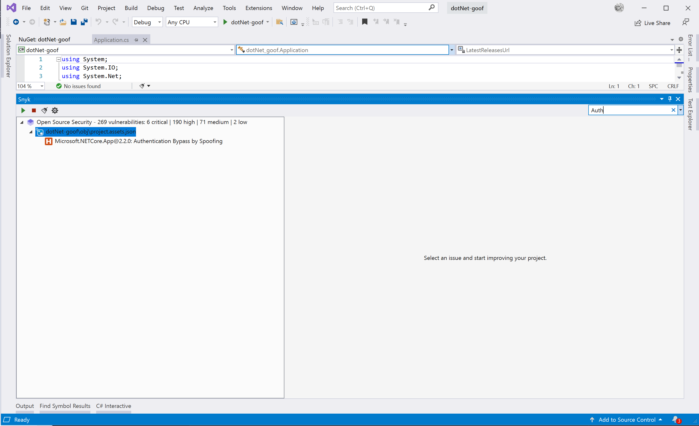
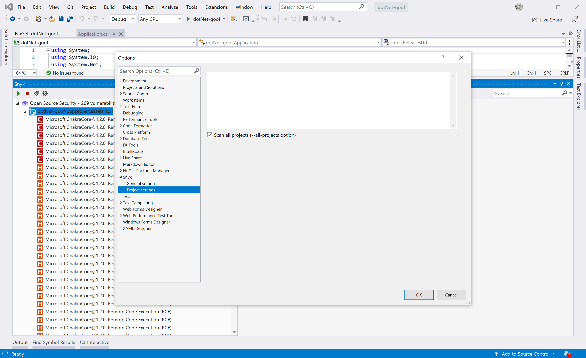

# View analysis results from Visual Studio extension

You can filter vulnerabilities by name or by severity.

Filter by name by typing the name of the vulnerability in the search bar.

Filter by severity by selecting one or more of the severities when you open the search bar filter.

Users can configure the Snyk extension by **Project settings**.

Note that the “Scan all projects” option is enabled by default. It adds the `--all-projects` option for Snyk CLI to scan all projects by default.

##
