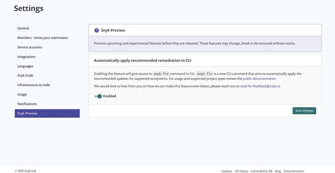

# Automatic fixing with snyk fix


**Release status and feature availability**

The snyk fix command is in [Closed Beta](../../getting-started/snyk-release-process.md#closed-beta) and available only for Enterprise plans. Snyk welcomes feedback at [snyk-fix-feedback@snyk.io](mailto:snyk-fix-feedback@snyk.io).

For more information, see [Plans and pricing](https://snyk.io/plans).


The `snyk fix` CLI command automatically applies the recommended updates for supported ecosystems. Ensure you use the latest version of CLI ([v1.715.0](https://github.com/snyk/snyk/releases/tag/v1.715.0) or later) to use `snyk fix`. The command is supported only for Python.

When you use the `snyk test` command, actionable fixes for supported ecosystems appear in the scan results as shown in the example that follows.

```
Tested 78 dependencies for known issues, found 34 issues, 145 vulnerable paths.Issues to fix by upgrading dependencies:  Upgrade django@2.2.13 to django@2.2.22 to fix
  ✗ HTTP Header Injection [High Severity][https://app.snyk.io/vuln/SNYK-PYTHON-DJANGO-1290072] in django@2.2.13
    introduced by django@2.2.13 and 13 other path(s)
  ✗ Directory Traversal (new) [High Severity][https://app.snyk.io/vuln/SNYK-PYTHON-DJANGO-1298665] in django@2.2.13
    introduced by django@2.2.13 and 13 other path(s)
  ✗ Insecure Permissions [High Severity][https://app.snyk.io/vuln/SNYK-PYTHON-DJANGO-609368] in django@2.2.13
    introduced by django@2.2.13 and 13 other path(s)
  ✗ Insecure Permissions [High Severity][https://app.snyk.io/vuln/SNYK-PYTHON-DJANGO-609369] in django@2.2.13
    introduced by django@2.2.13 and 13 other path(s)Organization:           libs
Package manager:        poetry
Target file:            lib/poetry.lock
Project name:           libs-develop
Open source:            no
Project path:           lib
Licenses:               enabled
```

The following example shows the output of running `snyk fix`.

```
► Running `snyk test` for /Users/lili/www/snyk/python-fix/packages/poetry/test/system/workspaces/with-pins✔ Looking for supported Python items
✔ Processed 1 pyproject.toml items
✔ DoneSuccessful fixes:  ../python-fix/packages/poetry/test/system/workspaces/with-pins/poetry.lock
  ✔ Upgraded django from 2.2.13 to 2.2.18
  ✔ Upgraded jinja2 from 2.11.2 to 2.11.3Summary:
  1 items were successfully fixed
  10 issues: 4 High | 3 Medium | 3 Low
  10 issues are fixable
  10 issues were successfully fixed
```

Note that only successful test results are forwarded to `snyk fix`. In addition, all unsupported ecosystem test results are skipped.

## Enabling snyk fix

To enable snyk fix during the beta period, click on **Settings** > **Snyk Preview**. Enable the **snyk fix feature** and click **Save changes**.



The `snyk fix` command supports all the `snyk test` command options and has the following additional options:

* `--quiet` - Suppress all output to the command line.
* `--dry-run` - Run almost all the logic and display output, but do not make the final changes to the relevant files. Show a preview of the changes.
* `--sequential` - Install each dependency update separately one at a time (the default is to install all at once). The default is much slower, but helps increase the number of successful updates by allowing some updates to fail and the process to continue.

## Python support

* Pip Projects with `requirements.txt` files or custom named files, for example `prod.txt`.
* Pipenv Projects with `Pipfile` and `Pipfile.lock` files
* Poetry Projects with `pyproject.toml` and `Poetry.lock` files

### Usage examples

`snyk fix --file=requirements.txt`

`snyk fix --file=base.txt --package-manager=pip`

`snyk fix --all-projects`

### Requirements with `-r` directives

Where the `requirements.txt` looks like this, both `base.txt` and `requirements.txt` are updated if needed:

```
-r base.txt # this means grab all the dependencies from here
django===1.6.1
```

#### **Direct dependency upgrades (dependencies stated in the manifest)**

Direct dependency upgrades are applied in the relevant files. All files referenced are found and updated.

#### **Pins (transitive dependencies that are pulled in via direct dependencies)**

Pins are applied in the manifest file that was tested.

If multiple files are tested but are related (for example one requires the other), Snyk starts to apply changes to the files higher up in the directory structure.

Snyk detects previously fixed files and skips applying fixes to them again.

### Projects that use `constraints.txt`

Constraints files are requirements files that control only which version of a dependency is installed, not whether it is installed or not. Their syntax and contents are nearly identical to requirements files. There is one key difference: including a package in a constraints file does not trigger installation of the package. For more information, see [User Guide - pip documentation v21.0.1](https://pip.pypa.io/en/stable/user_guide/#constraints-files).

#### **Direct dependency upgrades (dependencies stated in the manifest)**

Direct dependency upgrades are applied in the relevant files. All files referenced are found and updated.

#### **Pins (transitive dependencies that are pulled in via direct dependencies)**

All transitive dependencies are pinned in the `constraints.txt` file if referenced with the `-c` directive in the requirements manifest file.

### Python (`pipenv`)

Snyk delegates to `pipenv` directly to update dependencies to the specified recommended versions. All `pipenv` environment variables and behaviors are preserved as much as possible.

### Python (`poetry`)

Snyk delegates to `poetry` directly to update dependencies to the specified recommended versions. All `poetry` environment variables and behaviors are preserved as much as possible.

## Troubleshooting

Run in debug mode to get more information on any errors.

```
DEBUG=snyk snyk fix
```

This provides a very verbose output that can help diagnose issues or can be sent to Snyk for debugging.
